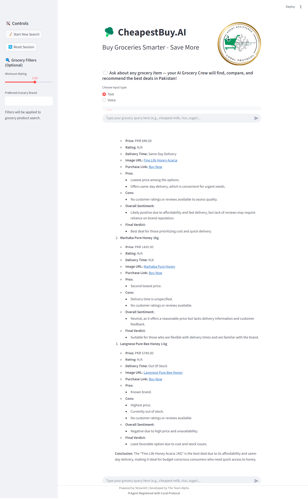
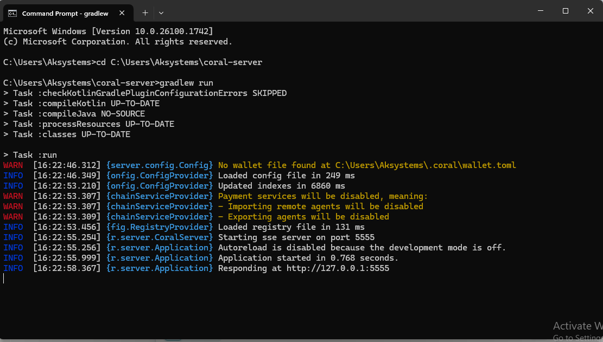
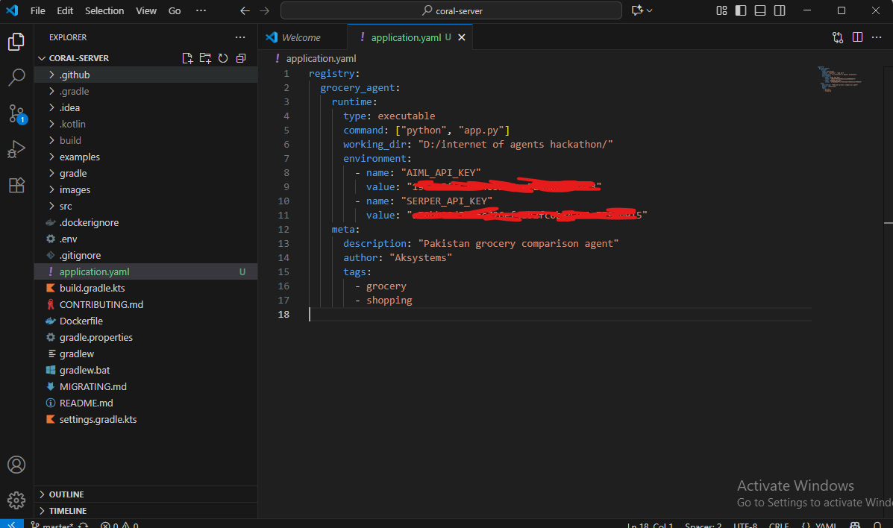

<p align="center">
  
</p>

# 🥦 CheapestBuy.AI

[](https://www.python.org/)
[](https://streamlit.io/)
[](./LICENSE)
[](https://aimlapi.com/)
[](https://docs.microsoft.com/en-us/windows/)

---

## Project Overview

**CheapestBuy.AI** is an intelligent, multi-agent grocery shopping assistant built with Streamlit and CrewAI.  
It searches, compares, and recommends the most affordable groceries in Pakistan, supporting both text and voice-based searches.

---
## Features

- 🪸 **Registered with Coral Protocol** (Agent registry for secure multi-agent operations)
- 🔎 Affordable grocery product search (Carrefour, Metro, Imtiaz)
- 📊 Product comparison: price, delivery options, reviews
- 🤖 Multi-agent pipeline (input, search, analysis, review, recommendation)
- 🔉 Voice search (AIML GPT-4o Whisper integration)
- 💬 User review and sentiment analysis (Daraz, Amazon, AliExpress)
- 🥇 Top 3 detailed recommendations (with images, links, pros, cons, delivery info)
- 🏷️ Simple, beginner-friendly Streamlit UI with filters & history
---

<div style="display: flex; align-items: center; justify-content: center; gap: 30px;">

  <!-- Left side: Tech Stack table -->
  <div style="flex: 1;">

  ## Tech Stack

  | Component      | Details                        |
  |----------------|-------------------------------|
  | Python         | 3.10+                          |
  | Streamlit      | UI, chat interface             |
  | CrewAI         | Multi-agent workflow           |
  | AIML API       | GPT-4o + Whisper for LLM/STT   |
  | Serper.dev     | Web search (Google results)    |
  | Custom Tools   | Grocery website scrapers       |

  </div>

  <!-- Right side: Image -->
  <div style="flex: 1; text-align: center;">
    <a href="https://your-app-name.onrender.com" target="_blank">
      
    </a>
    <br>
    
  </div>

</div>


---
<div style="display: flex; align-items: flex-start; justify-content: center; gap: 40px;">

  <!-- Left: Tech Stack -->
  <div style="flex: 1;">
    <h2>Tech Stack</h2>
    <table>
      <tr><td><b>Python</b></td><td>3.10+</td></tr>
      <tr><td><b>Streamlit</b></td><td>UI, chat interface</td></tr>
      <tr><td><b>CrewAI</b></td><td>Multi-agent workflow</td></tr>
      <tr><td><b>AIML API</b></td><td>GPT-4o + Whisper for LLM/STT</td></tr>
      <tr><td><b>Serper.dev</b></td><td>Web search (Google results)</td></tr>
      <tr><td><b>Custom Tools</b></td><td>Grocery website scrapers</td></tr>
    </table>
  </div>

  <!-- Right: Image -->
  <div style="flex: 1; text-align: center;">
    <a href="https://your-app-name.onrender.com" target="_blank">
      
    </a>
    <br><br>
    
  </div>

</div>

---

## 🪸 Coral Protocol Integration

Our agent is now registered on [Coral Protocol](https://coralprotocol.com/)!  
Coral enables secure agent registry and agent interactions across decentralized environments.

- **Agent registry proof:**  
  

### Agent Registration on Coral Server

To register our agent with Coral, we used an `application.yaml` configuration file.  
- **Configuration screenshot:**  
  

----

## Quick Start

### 1. Clone or Download

```bash
git clone https://github.com/teamalpha/cheapestbuy-ai.git
cd cheapestbuy-ai
```

### 2. Set Up Python Environment

```bash
python -m venv .venv
# Mac/Linux
source .venv/bin/activate
# Windows
.venv\Scripts\activate
```

### 3. Install Dependencies

```bash
pip install -r requirements.txt
```

### 4. Add API Keys to .env

Create a `.env` file in the project root folder:
```bash
AIML_API_KEY=your_aiml_api_key
SERPER_API_KEY=your_serperdev_api_key
```

### 5. Run the App

```bash
streamlit run app.py
```

---

## Usage

- Select text or voice input
- Enter your grocery query ("cheapest rice", "best milk", etc.)
- Apply filters (brand, minimum rating)
- View results — top 3 deals with images, links, and detailed reviews

---

## Workflow

1. **Input**  
   The grocery-related query is confirmed and refined.

2. **Web Search**  
   Retrieves product results from Google, Carrefour, Metro.

3. **Comparison**  
   Selects the top 3 cheapest and fastest-delivery options.

4. **Reviews**  
   Extracts customer reviews, pros, cons, and sentiment for each product.

5. **Recommendation**  
   Displays a concise summary for each option and highlights the best deal.

---

## Voice Search Info

- Format: `.wav` (max 5MB)
- AIML API Whisper-Large (GPT-4o)
- Clear warnings are provided in case of network timeout or error

---

## Team & Contributors

This project is the result of the hard work and collaboration of the following contributors:

- [SheemaMasood381](https://github.com/SheemaMasood381)
- [Tayyab666-star](https://github.com/Tayyab666-star)
- [EemaanAasghar](https://github.com/EemanAsghar)
- [Muhammad Ali](https://github.com/alimalik07)
  
---

## Contributing

- Fork the repository and submit a pull request
- Report bugs or issues (via GitHub Issues)

---

## License

MIT

---

**Developed by Team Alpha | Powered by Streamlit & CrewAI**
