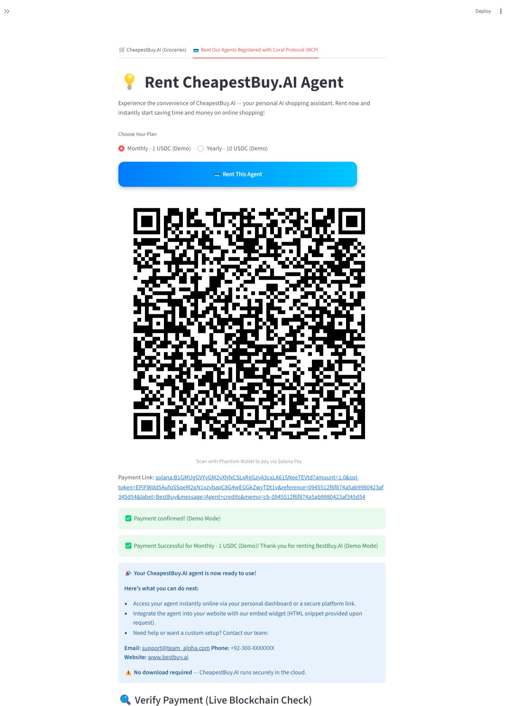
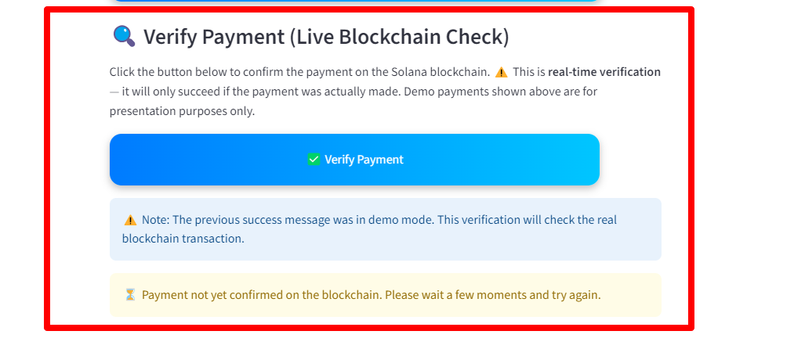

<p align="center">
  
</p>

# 🛒 CheapestBuy.AI  
*(Registered on Coral Protocol - MCP)*  

[](https://www.python.org/)
[](https://streamlit.io/)
[](./LICENSE)
[](https://aimlapi.com/)
[](https://docs.microsoft.com/en-us/windows/)
[](https://solanapay.com/)
[](https://render.com/)

---

## 🌍 Project Overview  

CheapestBuy.AI is an **AI-powered shopping agent** registered on **Coral Protocol (MCP)**.  
It helps users instantly find the **best deals** across multiple brands and categories (groceries, fashion, flights, hotels, etc.).  

### 🚀 Live Demo  
👉 [Try CheapestBuy.AI on Render](https://cheapestbuy-internet-of-agents-lablab.onrender.com/)  

---


---

## ✨ Features

- 🪸 **Registered with Coral Protocol** for secure multi-agent operations
- 🔎 Smart grocery search (Carrefour, Metro, Imtiaz, Daraz, etc.)
- 📊 Product comparison (price, delivery, ratings, reviews)
- 🤖 Multi-agent workflow: input → search → analysis → recommendation
- 🔉 Voice search (AIML GPT-4o Whisper)
- 💬 Customer review + sentiment analysis
- 🥇 Top 3 detailed product recommendations
- 🏷️ Beginner-friendly Streamlit UI with filters/history
- 💳 **Solana Pay Checkout (Demo)** with escrow-style fee math

---
<table>
<tr>
<td width="50%" valign="top">

<h2>Tech Stack</h2>

## 🛠️ Tech Stack  

## 🛠️ Tech Stack  

| Component        | Details                                  |
|------------------|------------------------------------------|
| Python           | 3.10+                                    |
| Coral Protocol   | **MCP agent registry & rental platform** |
| AIML API         | GPT-4o + Whisper for LLM/STT             |
| Streamlit        | UI, chat interface                       |
| CrewAI           | Multi-agent workflow                     |
| CrewAI-Tools     | Web scraping & search utilities          |
| LiteLLM          | LLM abstraction layer                    |
| Serper.dev       | Web search (Google results)              |
| SpeechRecognition| Voice input for agent queries            |
| Solana           | Blockchain SDK (v0.35.0)                 |
| Helius API       | Solana Pay on-chain verification         |
| Solders          | Solana transaction helpers (v0.21.0+)    |
| QRCode           | Payment QR generation                    |
| Requests         | API calls                                |
| Construct        | Binary parsing (v2.10.68)                |
| Chroma / HNSWlib | Vector DB for embeddings & retrieval     |
| Python-dotenv    | Environment variable management          |


</td>
<td width="50%" align="center">


</td>
</tr>
</table>

----
## 🪸 Coral Protocol Integration

Our agent is now registered on [Coral Protocol](https://coralprotocol.com/)!  
Coral enables secure agent registry and agent interactions across decentralized environments.

<table>
<tr>
<td align="center" width="50%">

<b>Agent registry proof</b><br>


</td>
<td align="center" width="50%">

<b>application.yaml for Coral Registration</b><br>


</td>
</tr>
</table>

-----

## 🤝 Rent This Agent

**CheapestBuy.AI** agent is **MCP-enabled** and securely registered on [Coral Protocol](https://coralprotocol.com/).  
This allows **third parties** and **end-users** to easily rent or integrate the agent into their own platforms.

### Why Rent This Agent?
- 🌍 Embed as a **widget** on your website or e-commerce store  
- 🛒 Offer your customers **instant cheapest grocery finder** inside your app  
- 🔐 Secured through **Coral MCP Registry** (verifiable agent identity)  
- ⚡ Pay-as-you-go or subscription-based renting model  
- 🧩 Extendable — can be configured for **custom categories** (e.g., hotels, flights, fashion, electronics)  

### Example Use-Cases
- 🛍️ E-commerce stores embedding grocery comparison in product pages  
- 🏪 Supermarkets or food chains offering instant price-check tool  
- ✈️ Travel portals extending with **hotel & flight deal search**  
- 🧾 Utility apps integrating CheapestBuy.AI as a **side widget**  

---

### 🔗 Embed on Your Website

Add this snippet in your webpage to instantly enable CheapestBuy.AI widget:

```html
<!-- Embed CheapestBuy.AI Agent -->
<iframe src="https://cheapestbuy.ai/widget" width="400" height="600"></iframe>
```

-------
## 💳 Solana Pay Integration (Demo)

This project includes a **demo integration** of Solana Pay using **Devnet USDC**.  
It is meant for hackathon/demo purposes only — not for production payments.

- Generates **QR codes** for Phantom wallet payments (Devnet USDC).  
- Displays escrow-style fee math (platform fee + vendor share).  
- Two modes:
  - **Demo mode**: always confirms payment (no blockchain check).  
  - **Real mode**: verifies on-chain transaction by reference using Solana Devnet RPC.  
- Works only with **Devnet USDC** (`USDC Mint: 4zMMC9srt5Ri5X14GAgXhaHii3GnPAEERYPJgZJDncDU`).  

### ⚠️ Security Note
> **Warning:** This demo is for hackathon/testing purposes only. Payments are on Solana Devnet and should NOT be used for real transactions. Never send real funds or confidential data. Always follow best security practices when integrating payment flows.

### Example flow:
1. User selects **Buy with Solana Pay**.  
2. Phantom wallet opens with a **demo Devnet USDC payment request**.  
3. After sending, user clicks **Verify Payment**.  
4. App confirms amount + fee split (escrow-style).  


---
---
### 🧪 Demo Payment Flow & 🔍 Live Blockchain Verification

<table>
<tr>
<td align="center" width="50%">
<b>Demo Payment Flow</b><br>
<br>

When the user selects <b>Rent This Agent</b>, the app generates a Solana Pay QR (Devnet USDC).  
After scanning with Phantom, the <b>demo mode</b> confirms payment instantly.  

</td>
<td align="center" width="50%">
<b>Live Solana Blockchain Verification</b><br>
<br>

The app also supports <b>real-time verification</b> on Solana Devnet via Helius API.  
This ensures the payment memo is actually confirmed on-chain before activating the agent.  

</td>
</tr>
</table>

--------

## ⚡ Quick Start

### 1. Clone or Download

If you are cloning the official hackathon repo:

```bash
git clone https://github.com/SheemaMasood381/CheapestBuy_Internet_of_agents_lablab_september2025.git
cd CheapestBuy_Internet_of_agents_lablab_september2025
```
_If you are forking, please clarify with your own repo name._

### 2. Set Up Python Environment

```bash
python -m venv .venv

# Mac/Linux
source .venv/bin/activate

# Windows
.venv\Scripts\activate
```

### 3. Install Dependencies

```bash
pip install -r requirements.txt
```

### 4. Add API Keys to .env

Create a `.env` file in the project root folder:
```bash
AIML_API_KEY=your_aiml_api_key
SERPER_API_KEY=your_serperdev_api_key

# Solana Pay 
MERCHANT_WALLET=your_devnet_phantom_wallet
PRICE_PER_CREDIT_USDC=0.5
SOLANA_CLUSTER=https://api.devnet.solana.com
USDC_MINT=4zMMC9srt5Ri5X14GAgXhaHii3GnPAEERYPJgZJDncDU

# Demo toggle (1 = always confirm, 0 = real Devnet verify)
DEMO_VERIFY_ALWAYS_OK=1
#helius api key
HELIUS_API_KEY=your_helius_api_key

```

### 5. Run the App

```bash
streamlit run app.py
```

---

## 📝 Usage

- Select text or voice input
- Enter your grocery query ("cheapest rice", "best milk", etc.)
- Apply filters (brand, minimum rating)
- View results — top 3 deals with images, links, and detailed reviews

---

## 🧩 Workflow

1. **Input**  
   The grocery-related query is confirmed and refined.

2. **Web Search**  
   Retrieves product results from Google, Carrefour, Metro.

3. **Comparison**  
   Selects the top 3 cheapest and fastest-delivery options.

4. **Reviews**  
   Extracts customer reviews, pros, cons, and sentiment for each product.

5. **Recommendation**  
   Displays a concise summary for each option and highlights the best deal.
   
6. **Checkout (Demo)**  
   Generates a Solana Pay QR → user pays in Phantom (Devnet USDC) → demo/verify flow confirms.

---

## 🔉 Voice Search Info

- Format: `.wav` (max 5MB)
- AIML API Whisper-Large (GPT-4o)
- **Supported Languages:** English, Urdu, (expandable via Whisper’s multilingual model)
- **Privacy:** Voice files are processed in-memory and not stored on disk/server. User privacy is respected.
- Clear warnings are provided in case of network timeout or error

---

## 📈 Future Enhancements

Beyond groceries, CheapestBuy.AI will expand into multiple categories:

- 💄 Beauty & Personal Care  
- 💻 Electronics  
- 🍲 Food & Beverages  
- 👗 Fashion & Apparel  
- 🪑 Furniture & Home  
- 🧹 Household Essentials  
- 🧸 Toys & Hobbies  
- 🔨 DIY & Hardware  
- 👶 Baby Products  
- 🚗 Auto & Parts  
- 🏋️ Sports & Fitness  
- 🏨 Hotel Bookings  
- ✈️ Flights  
- 🎯 Personalized Shopping Widgets for 3rd-party sites  

---

## 👥 Team & Contributors

This project is the result of the hard work and collaboration of the following contributors:

- [Tayyab666-star](https://github.com/Tayyab666-star)
- [EemanAsghar](https://github.com/EemanAsghar)
- [Muhammad Ali](https://github.com/alimalik07)
- [SheemaMasood381](https://github.com/SheemaMasood381)
  
---

## 🤲 Contributing

- Fork the repository and submit a pull request
- Report bugs or issues (via GitHub Issues)
- For queries and collaboration, contact: **sheema.masood381@gmail.com**

---

## 📜 License

This project is licensed under the MIT License.  
See the [LICENSE](./LICENSE) file for details.

---

**Developed by Team Alpha | Powered by Streamlit & CrewAI**
